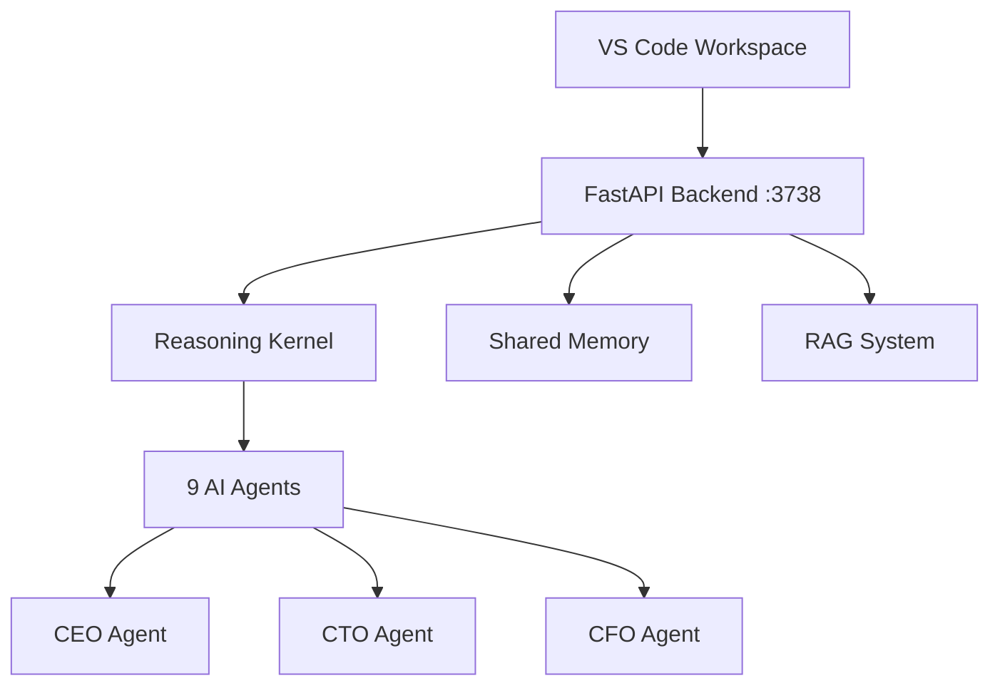

# 🎯 VBoarder Perfect Development Setup

## One-Click Development Experience ✨

This workspace is configured for **maximum developer productivity** with zero friction startup.

### 🚀 Quick Start Options

#### Option 1: VS Code Command Palette

- Press `Ctrl+Shift+P`
- Type "Tasks: Run Task"
- Select `🎯 Perfect Dev Setup`

#### Option 2: Manual Scripts

```bash
# Quick reasoning test
./quick_test.sh "Your test message"

# System status dashboard
./vboarder_status.sh

# Start backend manually
source .venv-wsl/bin/activate
uvicorn api.main:app --host 127.0.0.1 --port 3738 --reload
```

#### Option 3: Task Runner

- Press `Ctrl+Shift+P`
- Type "Tasks: Run Build Task"
- Automatically runs Perfect Dev Setup

### 🛠️ What the Perfect Setup Does

1. **🔍 Environment Check**: Validates Python, virtual env, dependencies
2. **📊 System Status**: Shows all services and agent status
3. **🚀 Backend Launch**: Starts FastAPI with hot reload
4. **🧪 Reasoning Test**: Validates multi-agent reasoning kernel
5. **📱 Ready to Code**: All systems operational

### 🏗️ Architecture Overview



### 🧪 Debug Configurations Available

- **🧠 Reasoning Kernel Debugger**: Step through multi-agent reasoning
- **🚀 Backend API Debugger**: Debug FastAPI endpoints
- **🤖 Agent Chat Debugger**: Debug individual agent conversations

### 📋 Debugging Quick Commands

```bash
# Test reasoning endpoint
curl -X POST "http://127.0.0.1:3738/ask?reasoning=loop" \
  -H "Content-Type: application/json" \
  -d '{"task": "Test reasoning", "agent": "CEO"}'

# Test agent chat
curl -X POST "http://127.0.0.1:3738/chat/CEO" \
  -H "Content-Type: application/json" \
  -d '{"message": "Hello CEO"}'

# Health check
curl http://127.0.0.1:3738/health
```

### 🎯 Development Workflow

1. **Start**: Run `🎯 Perfect Dev Setup` task
2. **Code**: Edit agent logic, API endpoints, reasoning kernel
3. **Test**: Use quick reasoning test or debug configurations
4. **Validate**: Check system status dashboard
5. **Ship**: All systems validated and operational

### 🔧 Advanced Configuration

**Model Configuration** (CRITICAL):

- Uses `mistral:latest` via Ollama
- ❌ Never use `mixtral` (too large, breaks backend)
- Configuration in: `docs/MODEL_CONFIG.md`

**Memory System**:

- Global: `data/memory.jsonl`
- Per-agent: `agents/*/memory.jsonl`
- Shared facts: Cross-agent communication

**Agent Structure**:

- Each agent: `agents/{ROLE}/config.json`, personas, prompts
- 9 agents: CEO, CTO, CFO, COO, CMO, CLO, COS, SEC, AIR

### 🆘 Troubleshooting

**Backend won't start?**

```bash
./vboarder_status.sh  # Check environment
source .venv-wsl/bin/activate  # Activate Python env
```

**Reasoning kernel errors?**

- Check Ollama is running: `ollama list`
- Verify model: `ollama run mistral`
- Test endpoint: `./quick_test.sh "debug test"`

**Agent memory issues?**

- Run: `bash tools/ops/repair-agents.sh`
- Validate: `bash tools/ops/validate-all.sh`

---

## 🎉 You're Ready to Build the Future

This workspace gives you **enterprise-grade AI development** with **zero-friction startup**.

**Happy coding!** 🚀💻✨
